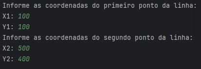
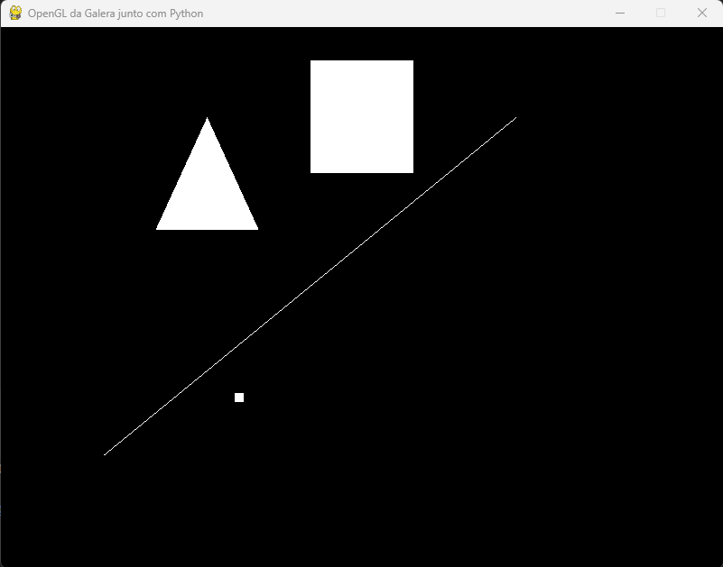
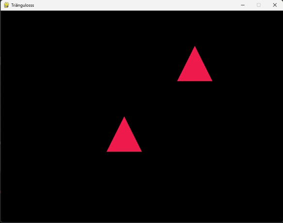
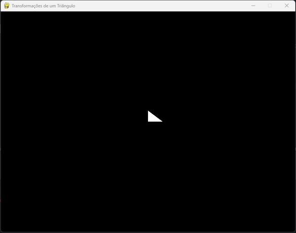
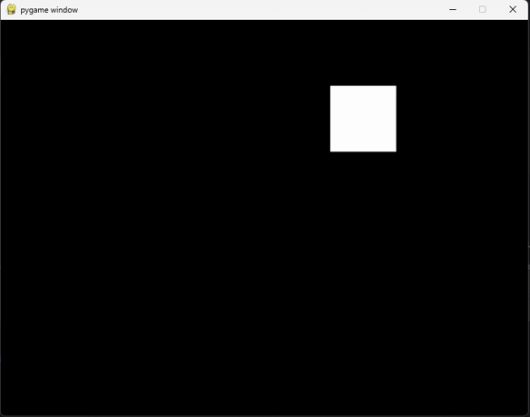
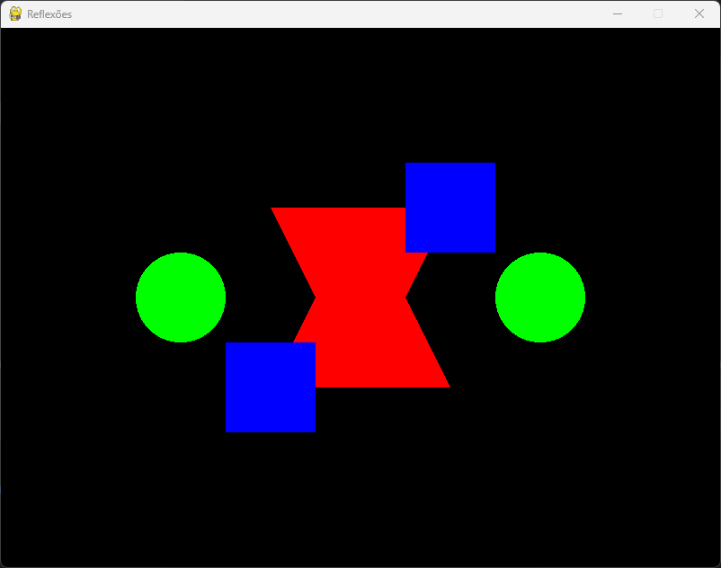
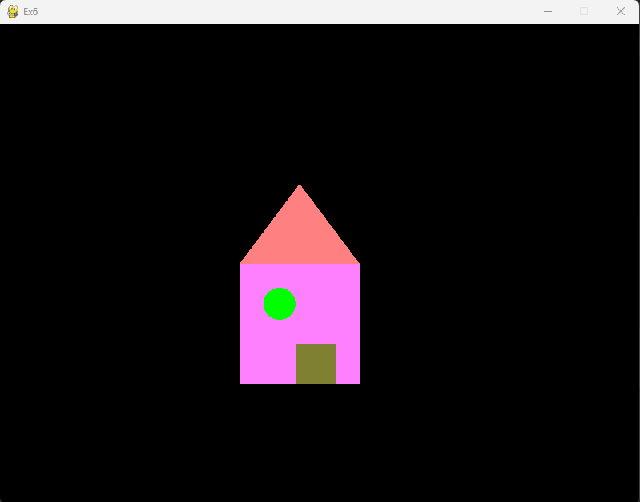
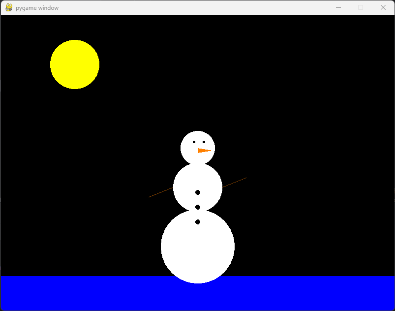
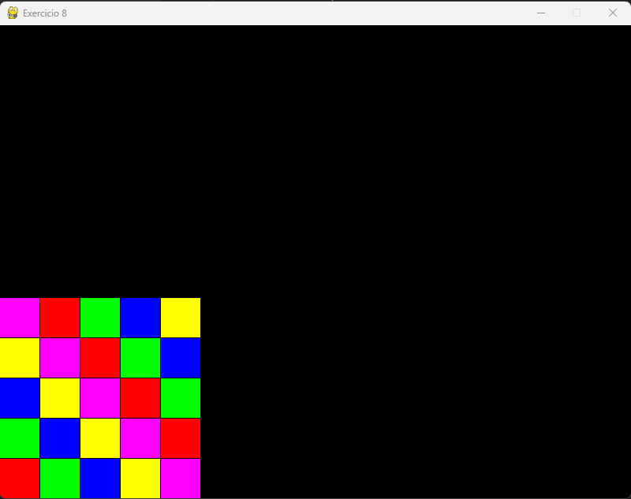

# CG-exercises

  Durante esta lista de exercícios, o que nosso grupo mais considerou para a resolução dos problemas foi seguir os exemplos apresentados nas aulas de Computação Gráfica. O nível de dificuldade dos exercícios aumenta progressivamente, assim, o conhecimento obtido com a realização dos primeiros exercícios facilitou bastante a compreensão dos próximos. Todos os exercícios seguiram uma lógica semelhante, o que contribuiu para a continuidade até o último desafio.

## Membros:

Eduardo Messer Marques - 1292226179  
Eduardo Rodrigues da Silva - 1292225421  
Lucca Emanuelli Moller das Neves - 1292220345  

# Exercìcio 1:
    Para inicar, terá de informar alguns valores no terminal, segue exemplo abaixo:

### Resultado:

# Exercìcio 2:

# Exercìcio 3:

# Exercìcio 4:

# Exercìcio 5:

# Exercìcio 6:

# Exercìcio 7:

# Exercìcio 8:
